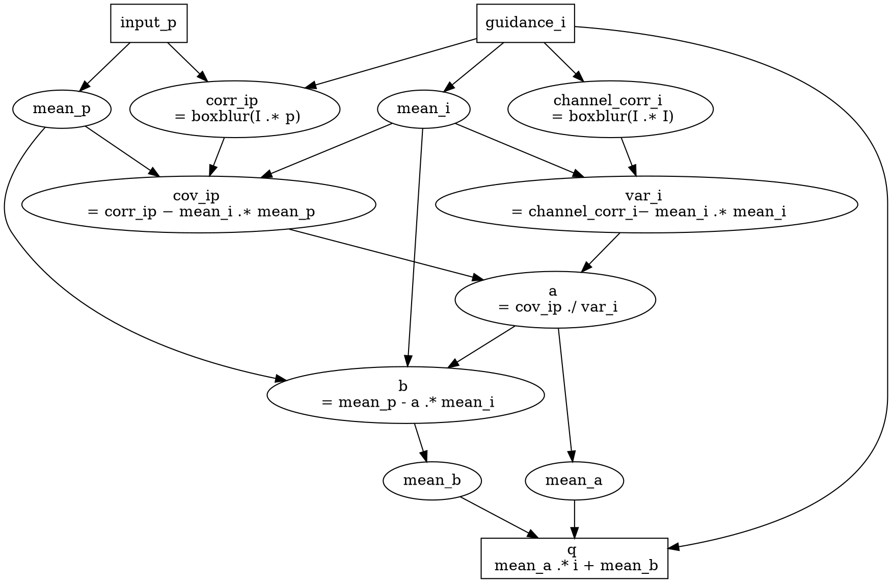

# Guided Filter Halide Implementation

### Compilation instructions:
```
mkdir build && cd build
cmake -DHalide_DIR=$(Insert halide directory) ..
make -j$(expr $(nproc) \+ 1)
```

### Algorithm

```dot
digraph G {
  rankdir = TB;

  i -> mean_i;
  p -> mean_p;

  i -> channel_corr_i;
  
  i -> corr_ip;
  p -> corr_ip;
  
  mean_i -> var_i;
  channel_corr_i -> var_i;
  
  mean_i -> cov_ip;
  mean_p -> cov_ip;
  corr_ip -> cov_ip;
  
  cov_ip -> a;
  var_i -> a;
  
  a -> b;
  mean_i -> b;
  mean_p -> b;
  
  a -> mean_a;
  b -> mean_b;
  
  mean_a -> q;
  mean_b -> q;
  i -> q;

  i [shape=rectangle, width=1, label=<guidance_i>];
  p [shape=rectangle, width=1, label=<input_p>];
  q [shape=rectangle, width=2, label=<q <br/> mean_a .* i + mean_b>];

  mean_i [label=<mean_i>]
  mean_p [label=<mean_p>]
  mean_a [label=<mean_a>]
  mean_b [label=<mean_b>]

  corr_ip [label=<corr_ip <br/> = boxblur(I .∗ p)>]
  channel_corr_i [label=<channel_corr_i <br/> = boxblur(I .∗ I)>]
  var_i [label=<var_i <br/> = channel_corr_i− mean_i .∗ mean_i>]
  cov_ip [label=<cov_ip <br/> = corr_ip − mean_i .∗ mean_p>]
  a [label=<a <br/> = cov_ip ./ var_i>]
  b [label=<b <br/> = mean_p - a .* mean_i>]
}
```